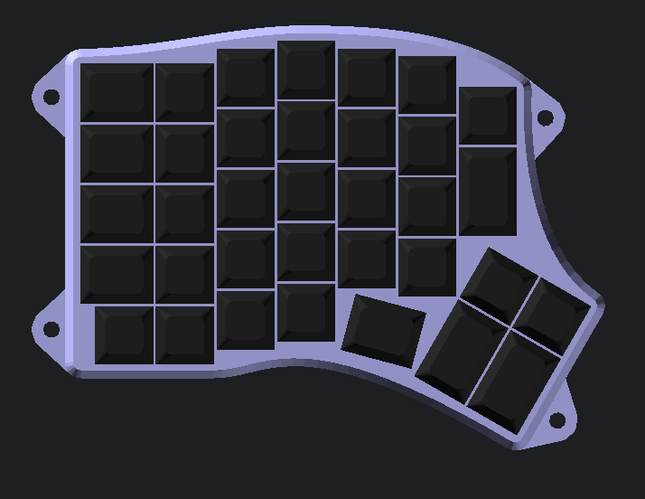
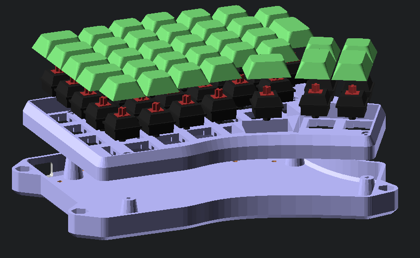
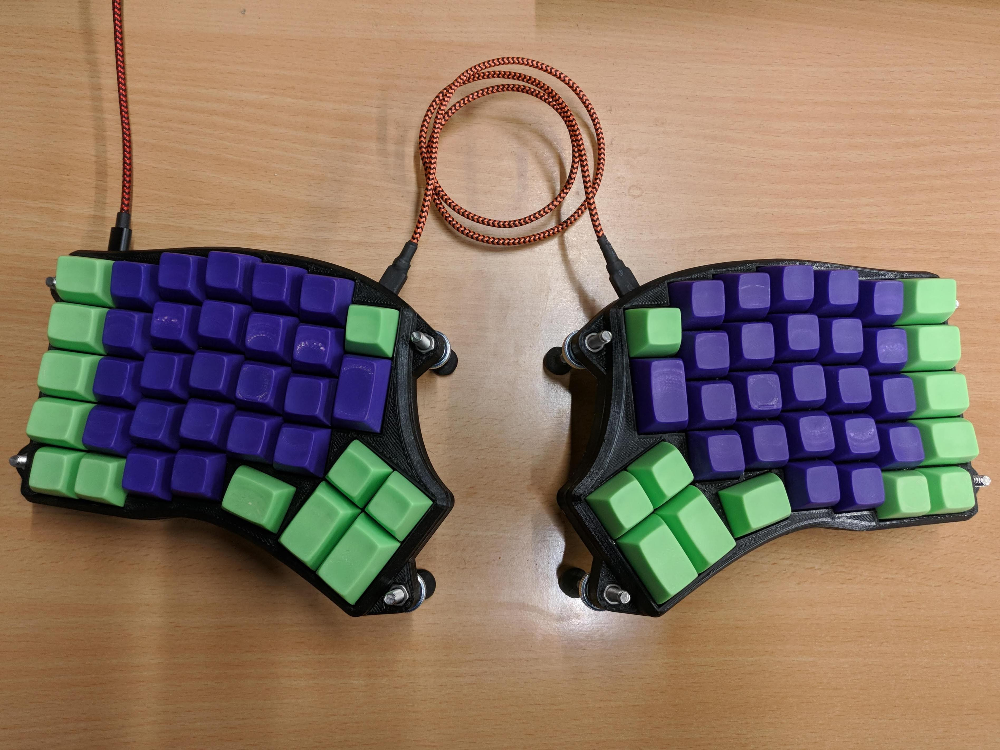

# A modified case for the Redox keyboard

The [Redox](https://www.thingiverse.com/thing:2704567) keyboard is a DIY mechanical 
keyboard by MattDB. It is sort of a cross between an 
[Iris](https://keeb.io/products/iris-keyboard-split-ergonomic-keyboard) and an 
[Ergodox](https://ergodox-ez.com/).

This repository uses OpenSCAD to make some modifications to the original STL to add
tenting etc, and also provides a new case generated in OpenSCAD from scratch.

When cloning, you need to make sure you get the submodules, e.g.:

    git clone --recurse-submodules https://github.com/Lenbok/scad-redox-case.git

## Modified version of the original case

This was my first modification of the original handwire redox case. Load the
`redox-body-mod.scad` into OpenSCAD, make any changes, and render the
modified STL.

This one has been built by a few people, e.g: [by me](https://imgur.com/a/DzFYMhc), 
and [a coworker](https://www.thingiverse.com/make:486818)

## Keyboard Case From Scratch

I then wanted to design a new case for the Redox that was inspired both
by the Redox Rev1 case and the Iris, and I thought it would be nice to
start with the layout from the [Keyboard Layout
Editor](http://www.keyboard-layout-editor.com/) JSON file (in this way
it could be extended to other keyboards). Existing tools I had found for
going from KLE JSON to OpenSCAD didn't work for split keyboards where
some keys are rotated, so an updated tool is provided here that seems to
work on the split keyboards I have tried.

If you have another KLE JSON file you want to convert, run the included
`jsonPositions.py` which spits out the key layout to a minimal OpenSCAD
data structure along with some data access functions. E.g:

    python3 jsonPositions.py <kle-examples/ergodox-layout.json >kle-examples/ergodox-layout.scad

Then make a top level OpenSCAD that includes this along with `keyboard_case.scad`, e.g.:

    include <kle-examples/ergodox-layout.scad>
    include <keyboard_case.scad>

Then to make a case, you just need to define a polygon describing the
outer boundary of your desired case, a set of points for where to put
case screw holes, and optional positions for tenting supports, and call
the `top_case` and/or `bottom_case` modules. See the other cases here
for examples (the Redox case is most developed):

[album here](https://imgur.com/a/eEi0gJ1)

